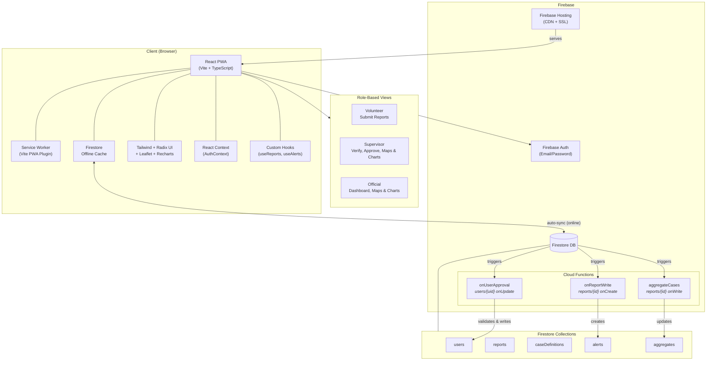

# SAHA-Care

**Community-Based Disease Surveillance PWA for Conflict-Affected Regions**

[](https://opensource.org/licenses/MIT)
[](https://github.com/)
[](https://web.dev/progressive-web-apps/)
[](https://firebase.google.com/)

> Main Project Page: *[SAHA-Care](https://leoding-error.github.io/saha-care/)*

---

## Overview

SAHA-Care is a progressive web app for community-based disease surveillance in conflict-affected regions, designed to work offline when connectivity fails. Health workers submit WHO-aligned case reports on mobile devices; supervisors verify them; officials monitor outbreak dashboards with maps, charts, and automated threshold alerts.

The initial implementation context is the **Gaza Strip**, where existing health surveillance infrastructure has collapsed under ongoing conflict and displacement. Reports are stored locally via Firestore's offline cache and automatically sync when connectivity resumes.

One app serves three roles: **Volunteers** submit reports, **Supervisors** verify and approve, **Officials** monitor outbreaks via dashboards.

---

## Prerequisites

| Tool | Version | Notes |
|---|---|---|
| Node.js | v20 | Required — Cloud Functions won't build on earlier versions |
| Java | 11+ | Required for Firebase Emulator Suite |
| Firebase CLI | v13+ | `npm install -g firebase-tools` |
| Git | any | — |

Check your versions:

```bash
node -v        # should print v20.x.x
java -version  # should print 11.x or higher
firebase --version
```

---

## Quick Start

**Clone and install:**

```bash
git clone <repo-url>
cd saha-care
./setup.sh
```

`setup.sh` installs root and Cloud Functions dependencies, builds the functions TypeScript, and creates `.env.local` from `.env.example`.

**Configure Firebase credentials** — see [Environment Variables](#environment-variables) below.

**Run the app:**

```bash
./run.sh          # starts emulators + Vite dev server (default)
```

| URL | Description |
|---|---|
| http://localhost:5173 | App |
| http://localhost:4000 | Firebase Emulator UI |
| http://localhost:8080 | Firestore emulator |
| http://localhost:9099 | Auth emulator |

**Seed test data** (optional but recommended):

```bash
./run.sh seed     # seeds 10 WHO disease definitions + 150 sample reports
```

Other `run.sh` commands:

```
./run.sh app        # Vite dev server only (no emulators)
./run.sh emulators  # emulators only
./run.sh test       # run unit tests
./run.sh build      # production build
./run.sh help       # list all commands
```

---

## Environment Variables

Copy `.env.example` to `.env.local` and fill in your Firebase project config.

```bash
cp .env.example .env.local
```

| Variable | Description | Where to find |
|---|---|---|
| `VITE_FIREBASE_API_KEY` | Web API key | Firebase Console → Project Settings → General → Your apps → SDK snippet |
| `VITE_FIREBASE_AUTH_DOMAIN` | Auth domain | Same location (`<project>.firebaseapp.com`) |
| `VITE_FIREBASE_PROJECT_ID` | Project ID | Same location |
| `VITE_FIREBASE_STORAGE_BUCKET` | Storage bucket | Same location |
| `VITE_FIREBASE_MESSAGING_SENDER_ID` | Messaging sender ID | Same location |
| `VITE_FIREBASE_APP_ID` | App ID | Same location |
| `VITE_FIREBASE_MEASUREMENT_ID` | Analytics measurement ID | Same location (optional) |

> **For local emulator development, placeholder values work.** The app auto-detects `localhost` and connects to emulators instead of live Firebase — credentials are only needed when targeting a real project.

---

## Test User Credentials

Emulator data resets each time you restart. After running `./run.sh`, create these three accounts once per session.

### Suggested credentials

| Role | Email | Password |
|---|---|---|
| Official | `official@saha.test` | `Saha2026!` |
| Supervisor | `supervisor@saha.test` | `Saha2026!` |
| Volunteer | `volunteer@saha.test` | `Saha2026!` |

### Setup steps

**1. Register Supervisor and Volunteer via the app:**
- Open http://localhost:5173 → click **Sign Up**
- Create `supervisor@saha.test` with role **Supervisor**, any region
- Create `volunteer@saha.test` with role **Volunteer**, same region

**2. Create the Official account via Emulator UI:**
- Open http://localhost:4000 → **Authentication** tab
- Click **Add user** → enter `official@saha.test` / `Saha2026!` → save and note the generated UID

**3. Create the Official's Firestore profile:**
- Still in Emulator UI → **Firestore** tab → `users` collection → **Add document**
- Set Document ID = the UID from step 2
- Add these fields:

| Field | Type | Value |
|---|---|---|
| `uid` | string | *(same UID)* |
| `email` | string | `official@saha.test` |
| `displayName` | string | `Test Official` |
| `role` | string | `official` |
| `status` | string | `approved` |
| `region` | string | `Gaza City` |
| `createdAt` | timestamp | *(now)* |
| `updatedAt` | timestamp | *(now)* |

**4. Approve the Supervisor:**
- In Firestore → `users` collection → find the supervisor document → set `status` to `approved`

**5. Approve the Volunteer:**
- Log in as the supervisor → go to **Volunteers** → approve `volunteer@saha.test`

All three accounts are now active. You can switch between them to exercise each role.

---

## Architecture



**Tech stack:**

| Layer | Technology |
|---|---|
| Framework | React + Vite + TypeScript (PWA) |
| UI | Tailwind CSS + Radix UI (shadcn/ui) |
| Maps | Leaflet + OpenStreetMap |
| Charts | Recharts |
| State | React Context + Firestore `onSnapshot` listeners |
| Database | Firestore (NoSQL, offline sync, real-time, security rules) |
| Auth | Firebase Auth (email/password) |
| Server-side | Cloud Functions (Node.js 20 / TypeScript) — 3 Firestore-triggered functions |
| Hosting | Firebase Hosting (CDN + SSL) |
| Offline | Firestore offline cache + Vite PWA plugin (service worker) |
| Testing | Vitest + Testing Library |

---

## User Roles

| Role | Access | Approval |
|---|---|---|
| **Volunteer** | Submit reports | Approved by supervisor |
| **Supervisor** | Review/verify reports, approve volunteers, maps, regional charts | Approved by official |
| **Official** | Dashboard, aggregated data, maps, charts, approve supervisors | Pre-provisioned (cannot self-register) |

Self-registration is open for Volunteer and Supervisor roles. Users enter a `pending` state until approved by a higher role.

---

## Cloud Functions

Server-side logic triggered by Firestore writes — no HTTP endpoints needed.

| Function | Trigger | Purpose |
|---|---|---|
| `onUserApproval` | `users/{uid}` onUpdate | Validates role escalation, enforces region scoping |
| `onReportWrite` | `reports/{id}` onCreate | Checks thresholds per disease/region, auto-creates alerts |
| `aggregateCases` | `reports/{id}` onWrite | Maintains pre-computed rollups for dashboard performance |

---

## Data Model

**Firestore Collections:**

- `users` — uid, email, displayName, role, status, supervisorId, region
- `reports` — disease, symptoms, temp, location, status, reporterId, verifiedBy
- `caseDefinitions` — disease, symptoms, dangerSigns, guidance, threshold
- `alerts` — disease, region, caseCount, threshold, severity, status
- `aggregates` — disease, region, period, caseCount, verifiedCount, lastUpdated

See [`docs/firestore-schema.md`](docs/firestore-schema.md) for the full schema reference and [`docs/diagrams/erd.mmd`](docs/diagrams/erd.mmd) for the entity-relationship diagram.

---

## Repository Structure

```
saha-care/
├── src/                      # React PWA source
│   ├── components/           # Shared UI components
│   │   ├── charts/           # CaseBarChart, TrendLineChart, KPICard
│   │   ├── common/           # OfflineIndicator
│   │   ├── forms/            # ReportForm
│   │   ├── maps/             # MapView, ReportMarker, ClusterLayer
│   │   └── users/            # ApprovalConfirmDialog, PendingUsersList, etc.
│   ├── pages/
│   │   ├── auth/             # LoginPage, RegisterPage
│   │   ├── official/         # OfficialHomePage, PendingSupervisorsPage
│   │   ├── supervisor/       # SupervisorHomePage, PendingVolunteersPage
│   │   └── volunteer/        # ReportFormPage, ReportListPage
│   ├── services/             # Firebase config, auth, reports, users, dashboard
│   ├── contexts/             # AuthContext
│   ├── hooks/                # useCaseDefinitions, useOfflineStatus
│   ├── types/                # TypeScript interfaces
│   └── constants/            # roles, regions
├── functions/                # Cloud Functions (Node.js 20 + TypeScript)
│   └── src/
│       ├── onUserApproval.ts
│       ├── onReportWrite.ts
│       ├── aggregateCases.ts
│       └── index.ts
├── scripts/                  # seedCaseDefinitions, seedReports, generateIcons
├── docs/                     # FIREBASE_SETUP.md, MANUAL_TESTS.md, diagrams/, plans/
├── public/                   # PWA icons
├── firestore.rules
├── firebase.json
├── .env.example
├── setup.sh                  # One-time project setup
├── run.sh                    # Dev workflow entrypoint
└── vite.config.ts
```

---

## Known Limitations

- **Emulator data is ephemeral** — Firestore and Auth data reset every time `firebase emulators:start` restarts. Re-run test account setup and `./run.sh seed` each session.
- **Cloud Functions require emulators** locally — threshold alerts and aggregate rollups only trigger when the Firebase emulators are running (`./run.sh`, not `./run.sh app`).
- **Node 20 is required** — `functions/` will fail to build or deploy on earlier Node versions.
- **Official accounts cannot self-register** — they must be provisioned directly in Firestore (emulator UI in dev, Admin SDK in prod).
- **Offline sync is device-limited** — Firestore offline cache is bounded by device storage; very large datasets may not fully cache on low-end Android.
- **In-app messaging is not implemented** — the Conversations/Messages data model is defined but the UI is a placeholder for a future phase.
- **Arabic (RTL) localization is not implemented**.
- **PWA install prompt requires a production build** — the dev server does not trigger the "Add to Home Screen" prompt. To test it: run `./run.sh build`, then `firebase emulators:start --only hosting`.

---

## Ethical Considerations

Working in conflict-affected zones introduces significant ethical responsibilities:

- **Data minimization** — Collect only what is necessary for epidemiological surveillance
- **Conflict-sensitive design** — Avoid data collection that could endanger reporters or communities
- **Community trust** — Co-design and community validation are central to the implementation framework
- **No-harm principle** — Compliance with ICRC data protection standards for humanitarian contexts

---

## Team

| Name | Role | Program |
|---|---|---|
| **Leo** | Software Engineering, Technical Architecture, Firebase Deployment | CS Graduate Student, Emory University |
| **Dalia** | Public Health Framing, Literature Review, Health Domain Expertise | Public Health Graduate Student, Rollins School of Public Health |

---

## License

This project is open-source under the [MIT License](LICENSE). We encourage adaptation for other humanitarian and crisis contexts.

---

*SAHA-Care | Emory University | Spring 2026*
